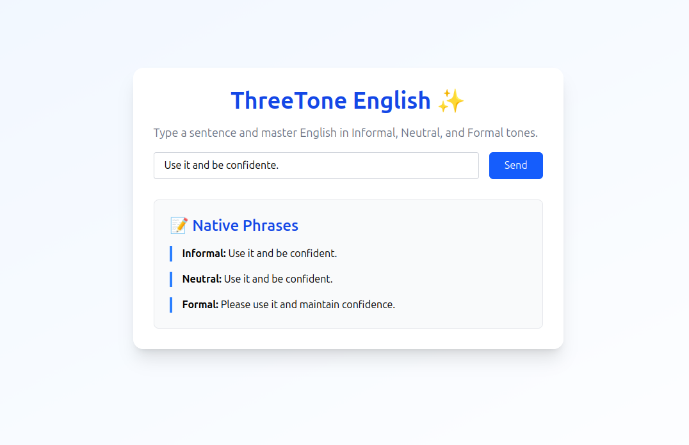

# 🧠 English GPT Tips


A lightweight chatbot powered by OpenAI's GPT-4.1-mini that gives **short and direct English learning tips**.

This app is focused on a single purpose: help users ask **simple questions about English** and receive **brief, useful answers**.

---

## ✨ Features

- 🎯 Focused on English tips only  
- 💬 Short and polite AI responses  
- ⚡ Fast and minimal frontend (Next.js + Tailwind CSS)  
- ☁️ Ready for deployment on Vercel

---

## 📸 Demo



---

## 📋 Requirements

- Node.js & npm (tested with **Node 20 / npm 10**)  
- An **OpenAI API key** (GPT access required)  
- Git installed locally  

---

## 🚀 Getting Started

### 1. Clone the repository

```
git clone https://github.com/seu-usuario/english-gpt-tips.git
cd english-gpt-tips

```
### 2. Install dependencies

```

npm install

```

### 3. Set environment variables
Create a .env.local file and add your OpenAI key and system prompt:

```

OPENAI_API_KEY=your-openai-api-key
CHAT_SYSTEM_PROMPT=Please correct the following English sentence and return three natural versions: one informal, one neutral (everyday), and one formal. Keep the original meaning.

```

### 4.Run the development server
``` 
npm run dev
```

| Visit http://localhost:3000 (3000 is a default port) in your browser.

DouglasBarbosa @ 2025